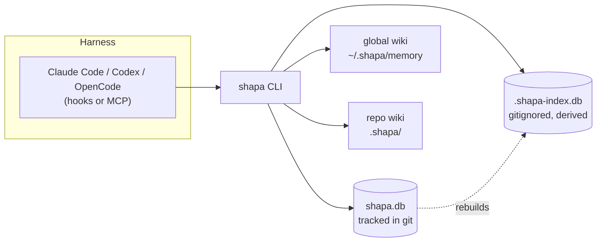

# shapa

[](https://github.com/Roukh/shapa-llm/actions/workflows/test.yml)
[](https://pypi.org/project/shapa/)
[](https://pypi.org/project/shapa/)
[](LICENSE)

shapa gives a coding agent memory and a work ledger that live in one SQLite
file per project, checked into git, with hooks for Claude Code, Codex and
OpenCode.

## Install

Once shapa is on PyPI:

```bash
uv tool install 'shapa[semantic,mcp]'
# or
pipx install shapa
```

Until then, install straight from GitHub:

```bash
curl -fsSL https://raw.githubusercontent.com/Roukh/shapa-llm/main/bootstrap.sh | sh
```

`bootstrap.sh` installs the `shapa` command (pipx, then uv, then `pip
--user`) and wires Claude Code's hooks. Pass `--with-semantic`, `--with-mcp`
or `--full` to add the optional extras up front; see the comments at the top
of the script for every flag and environment variable.

## 60-second quickstart

```bash
# 1. Install shapa (see above).

# 2. In a git repo, create its wiki:
cd your-project
shapa init

# 3. Check that everything is wired correctly:
shapa doctor

# 4. Start your agent as usual. In Claude Code, shapa's hooks load memory
#    at session start and on every prompt; Codex and OpenCode reach the
#    same memory through shapa's MCP tools.
```

`shapa init` finds the git top level, creates `.shapa/` there and nothing
else, and installs two git hooks: `pre-commit` keeps the database off
feature branches, and `post-commit` closes the job a `J<n>:` commit names.
It never writes into a machine-wide `core.hooksPath` or into hooks owned by
husky, lefthook or the pre-commit framework; it prints the lines to add
there instead.

## What it does

- Surfaces relevant memory at session start and injects more on every
  prompt, ranked by relevance.
- Turns an operator's correction ("no", "wrong", "not like this") into an
  attributed issue row, not a buried chat line.
- Tracks work as a three-level ledger: a feature (`F`, a new capability
  with its own branch and PR) holds jobs (`J`, one commit each), and a job
  holds tasks (`T`). Fixes, docs and release work are standalone jobs that
  share one batch branch and PR per session. A commit whose subject starts
  `J<n>:` closes that job automatically.
- Sweeps the database after every merged feature: closed, expired,
  duplicate, superseded and stale rows are deleted, and the database's git
  history keeps the record.
- Commits `.shapa/` on the default branch at the end of each Claude Code
  session (`shapa commit`), so a clone of the repo carries its memory. It
  commits only wiki paths and never pushes.

## How it works



A repo's wiki is `.shapa/` at its git top level; the global wiki defaults to
`~/.shapa/memory`. Each holds `shapa.db`: the work ledger plus memory, rule
and issue rows. A second file, `.shapa-index.db`, holds the search index and
vectors; it is derived from `shapa.db`, gitignored, and rebuilt on demand. A
session reads from the global wiki and the current repo's wiki together, and
writes are scoped to one or the other.

## Harness support

| Harness | Hooks | MCP |
|---|---|---|
| Claude Code | yes | yes |
| Codex | no | yes |
| OpenCode | no | yes |
| anything else that speaks MCP | no | by hand (see `shapa mcp`) |

Hooked harnesses get memory pushed to them automatically; any MCP client can
pull the same `search`, `get` and `save` tools by registering `shapa mcp` as
a stdio server itself.

## How it compares

Figures below are each project's own numbers, checked in October 2026; they
move fast and several benchmark claims in this space are disputed.

| Tool | Storage | Git-tracked | Work ledger | License |
|---|---|---|---|---|
| **shapa** | one SQLite file per wiki | yes, on the default branch | yes (F/J/T) | MIT |
| claude-mem | SQLite plus Chroma | no | no | Apache-2.0 |
| mem0 + OpenMemory MCP | vector DB plus graph | no | no | Apache-2.0 |
| basic-memory | Markdown plus wikilinks, Obsidian sync | if you commit the files | no | AGPL-3.0 |
| beads | Dolt, JSONL export | yes | yes (dependency graph, not memory) | MIT |
| native harness memory (Claude Code, Codex, Cursor, ...) | machine-local files | no | no | - |

None of the native, per-harness memory features are git-tracked, shared
across harnesses, split into a global and a repo tier, or tied to a work
ledger. The trade-off: a SQLite file does not diff or merge like Markdown,
which is why shapa commits it only on the default branch.

## Commands

| Command | Does |
|---|---|
| `shapa init [DIR] [--no-git] [--obsidian] [--global]` | create and register a wiki, with git hooks in a repo |
| `shapa doctor` | check the whole install; exits 1 with a fix command per problem |
| `shapa status` | the same report as `doctor`, without the exit code |
| `shapa commit [--hook] [--dry-run] [--json] [--scrub TERM]` | commit `.shapa/` on the default branch |
| `shapa bootstrap` | session-start overview of every wiki in scope |
| `shapa fetch` | rank and surface memory relevant to a prompt |
| `shapa get ID` | print a row's or a note's full text |
| `shapa save` | write one note or row (`--scope global\|repo\|external`) |
| `shapa row add\|edit\|rm\|link\|tag\|list` | manage memory, rule and issue rows |
| `shapa ledger add\|claim\|close\|tree\|issues` | manage the work ledger |
| `shapa correction` | record an operator correction as an issue row |
| `shapa maintain [--prune] [--dry-run]` | self-heal: merge duplicates, prune stale and orphaned rows |
| `shapa validate` | check note and wiki frontmatter |
| `shapa upgrade [--all] [--check]` | bring a wiki to the current format |
| `shapa mcp` | run the MCP stdio server (`search`, `get`, `save`, `placement`) |
| `shapa serve` | run the optional warm per-wiki daemon |

Run `shapa` with no arguments for the full, versioned usage text.

## Files and privacy

Everything shapa reads or writes stays on disk, in files you own:

- `~/.shapa/config.json` and `~/.shapa/wikis.json`: the global wiki pointer
  and the registry of known wikis.
- `~/.shapa/memory/`: the global wiki, unless `shapa init --global DIR`
  put it elsewhere.
- `<repo>/.shapa/shapa.db`: that repo's wiki, tracked in git.
- `<repo>/.shapa/.shapa-index.db`: the derived search index, gitignored.

There is no hosted service and no account, and shapa makes no network calls
of its own. Two exceptions you opt into: the `[semantic]` extra downloads
its embedding model once, and session distillation
(`SHAPA_CAPTURE_DISTILL=1`) and `shapa maintain --resolve` run the `claude`
CLI you already use. The core engine has no dependencies beyond the Python
standard library.

## Configuration

- `$SHAPA_MEMORY` overrides the resolved wiki directory for one process.
- `[semantic]` extra (`model2vec`) turns on local embeddings for fetch and
  maintain; without it, shapa uses BM25 and token overlap.
- `[mcp]` extra (`mcp`) upgrades `shapa mcp` to the reference MCP SDK; it
  works without the extra too, through a standard-library JSON-RPC shim.
- `scrub_terms` in `~/.shapa/config.json`: an optional list of terms
  `shapa commit` redacts before committing `.shapa/`.
- `install.sh --no-auto-commit` skips wiring `shapa commit` into Claude
  Code's session hooks; run `shapa commit` yourself instead.

## Development

See [CONTRIBUTING.md](CONTRIBUTING.md) for the dev setup, the test matrix
and the house rules this project runs on.

## License

MIT, see [LICENSE](LICENSE).
